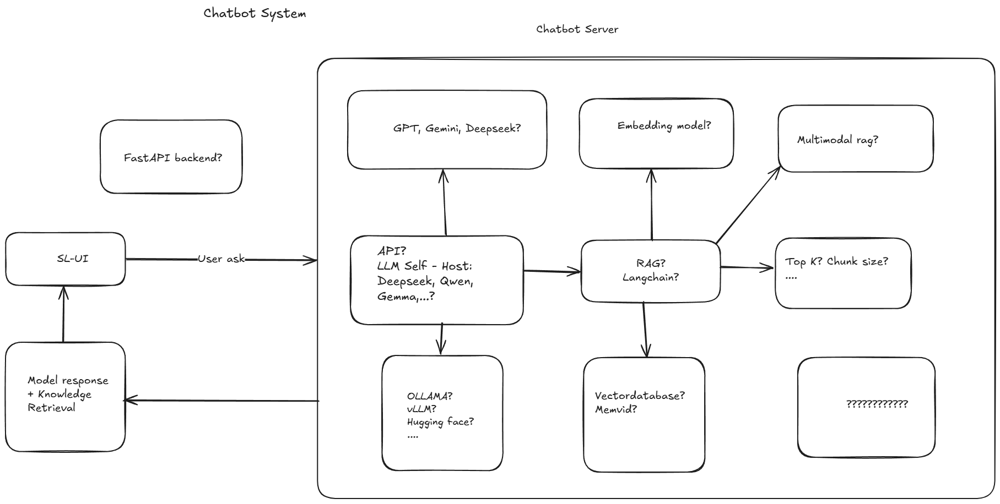

# 🤖 RAG Chatbot - Hệ thống Chat thông minh với Retrieval Augmented Generation



Một hệ thống chatbot thông minh sử dụng công nghệ RAG (Retrieval Augmented Generation) để trả lời câu hỏi dựa trên knowledge base tùy chỉnh. Project bao gồm FastAPI backend và React frontend hiện đại.

## ✨ Tính năng chính

- 🧠 **RAG Intelligence**: Chatbot trả lời dựa trên tài liệu trong knowledge base
- 📚 **Quản lý tài liệu**: Thêm tài liệu từ text hoặc web URLs
- 🔍 **Vector Search**: Tìm kiếm semantic với embeddings
- 💬 **Chat Interface**: Giao diện chat hiện đại với markdown support
- 📊 **Real-time Updates**: Cập nhật trạng thái real-time
- 📱 **Responsive Design**: Hoạt động tốt trên mọi thiết bị
- ⚡ **Fast API**: API hiệu năng cao với documentation tự động

## 🛠️ Công nghệ sử dụng

### Backend
- **FastAPI** - Modern Python web framework
- **LangChain** - Framework cho ứng dụng LLM
- **Google Generative AI** - LLM và embeddings (free tier)
- **ChromaDB** - Vector database
- **Beautiful Soup** - Web scraping
- **Pydantic** - Data validation

### Frontend
- **React 18** - Modern UI framework
- **TypeScript** - Type safety
- **Vite** - Lightning fast build tool
- **Tailwind CSS** - Utility-first CSS framework
- **React Router** - Client-side routing
- **Axios** - HTTP client
- **Lucide React** - Beautiful icons

## 📋 Yêu cầu hệ thống

- **Python** 3.8+ (cho backend)
- **Node.js** 16+ và npm (cho frontend)
- **Google API Key** (free tier)

## 🚀 Cài đặt và chạy

### 1. Clone repository

```bash
git clone <repository-url>
cd chatbot-rag
```

### 2. Cài đặt Backend

```bash
cd back-end

# Tạo virtual environment
python -m venv venv

# Kích hoạt virtual environment
# Windows:
venv\Scripts\activate
# macOS/Linux:
source venv/bin/activate

# Cài đặt dependencies
pip install -r requirements.txt
```

### 3. Cấu hình Environment cho Backend

Tạo file `.env` trong thư mục `back-end`:

```env
# Google API Configuration (Required)
GOOGLE_API_KEY=your_google_api_key_here

# Application Configuration
APP_NAME=RAG Chatbot API
APP_VERSION=1.0.0
DEBUG=True

# Model Configuration
LLM_MODEL=gemini-pro
EMBEDDING_MODEL=models/embedding-001
TEMPERATURE=0.0
MAX_TOKENS=1000

# Processing Configuration
CHUNK_SIZE=1000
CHUNK_OVERLAP=200
MAX_RETRIEVAL_DOCS=5

# Storage Configuration
VECTOR_STORE_PATH=./vector_store
DOCUMENTS_PATH=./data/documents
```

**🔑 Lấy Google API Key:**
1. Truy cập [Google AI Studio](https://makersuite.google.com/app/apikey)
2. Tạo API key mới
3. Copy và paste vào file `.env`

### 4. Chạy Backend

```bash
cd back-end
uvicorn app.main:app --reload --host 0.0.0.0 --port 8000
```

Backend sẽ chạy tại: http://localhost:8000

### 5. Cài đặt Frontend

Mở terminal mới:

```bash
cd front-end

# Cài đặt dependencies
npm install

# Chạy development server
npm run dev
```

Frontend sẽ chạy tại: http://localhost:3000

### 6. Truy cập ứng dụng

- **Frontend**: http://localhost:3000
- **Backend API Docs**: http://localhost:8000/docs
- **Backend Health**: http://localhost:8000/health

## 📖 Hướng dẫn sử dụng

### 1. Thêm tài liệu
- Truy cập trang **"Tài liệu"**
- Click **"Thêm tài liệu"**
- Chọn loại: **Text** hoặc **Trang web**
- Nhập nội dung hoặc URL
- Click **"Thêm"**

### 2. Chat với bot
- Truy cập trang **"Chat"**
- Nhập câu hỏi trong ô tin nhắn
- Bot sẽ trả lời dựa trên tài liệu đã thêm
- Click vào sources để xem nguồn tham khảo

### 3. Quản lý hệ thống
- Truy cập trang **"Cài đặt"**
- Xem trạng thái kết nối
- Quản lý vector store
- Xem thông tin cấu hình

## 🏗️ Kiến trúc hệ thống

```
chatbot-rag/
├── back-end/                    # FastAPI backend
│   ├── app/
│   │   ├── main.py             # FastAPI application
│   │   ├── core/               # Core configuration
│   │   ├── models/             # Pydantic models
│   │   ├── services/           # Business logic
│   │   ├── api/                # API routes
│   │   └── utils/              # Utilities
│   ├── vector_store/           # ChromaDB storage
│   ├── data/                   # Document storage
│   └── requirements.txt        # Python dependencies
│
├── front-end/                   # React frontend
│   ├── src/
│   │   ├── components/         # React components
│   │   ├── pages/              # Main pages
│   │   ├── services/           # API services
│   │   ├── context/            # State management
│   │   ├── types/              # TypeScript types
│   │   └── main.tsx            # Entry point
│   ├── package.json            # Node dependencies
│   └── vite.config.ts          # Vite configuration
│
└── README.md                    # Documentation
```

## 🔄 Quy trình RAG

1. **📥 Thêm tài liệu**: Upload text hoặc load từ web URL
2. **✂️ Text Splitting**: Chia tài liệu thành chunks nhỏ
3. **🧮 Embedding**: Tạo vector embeddings cho từng chunk
4. **💾 Vector Store**: Lưu embeddings vào ChromaDB
5. **❓ Query**: User gửi câu hỏi
6. **🔍 Retrieval**: Tìm chunks liên quan từ vector store
7. **🤖 Generation**: LLM tạo câu trả lời dựa trên context
8. **📤 Response**: Trả về câu trả lời kèm sources

## 🔗 API Endpoints

### Chat
- `POST /api/v1/chat/` - Gửi tin nhắn
- `GET /api/v1/chat/conversations` - Danh sách cuộc hội thoại
- `DELETE /api/v1/chat/conversations/{id}` - Xóa cuộc hội thoại

### Documents
- `POST /api/v1/documents/text` - Thêm tài liệu text
- `POST /api/v1/documents/web` - Thêm từ web URL
- `GET /api/v1/documents/` - Danh sách tài liệu
- `DELETE /api/v1/documents/{id}` - Xóa tài liệu

### System
- `GET /health` - Health check
- `GET /api/v1/info` - Thông tin API

## 📝 Ví dụ sử dụng API

### Thêm tài liệu text
```bash
curl -X POST "http://localhost:8000/api/v1/documents/text" \
  -H "Content-Type: application/json" \
  -d '{
    "content": "Machine Learning là một nhánh của trí tuệ nhân tạo...",
    "title": "Giới thiệu Machine Learning"
  }'
```

### Chat với bot
```bash
curl -X POST "http://localhost:8000/api/v1/chat/" \
  -H "Content-Type: application/json" \
  -d '{
    "message": "Machine Learning là gì?",
    "include_sources": true
  }'
```

### Thêm tài liệu từ web
```bash
curl -X POST "http://localhost:8000/api/v1/documents/web" \
  -H "Content-Type: application/json" \
  -d '{
    "url": "https://example.com/article",
    "title": "Bài viết về AI"
  }'
```

## 🐛 Troubleshooting

### Backend Issues

**❌ Lỗi Google API Key**
```
Error: Invalid API key
```
**✅ Giải pháp**: Kiểm tra `GOOGLE_API_KEY` trong file `.env`

**❌ Lỗi Import Module**
```
ModuleNotFoundError: No module named 'app'
```
**✅ Giải pháp**: Chạy từ thư mục `back-end` với `python -m uvicorn app.main:app --reload`

**❌ Lỗi Vector Store**
```
Error initializing vector store
```
**✅ Giải pháp**: Xóa thư mục `vector_store` và restart server

### Frontend Issues

**❌ API Connection Failed**
```
Network Error
```
**✅ Giải pháp**: 
- Kiểm tra backend đang chạy trên port 8000
- Check CORS settings

**❌ Build Failed**
```
Type error in component
```
**✅ Giải pháp**: Chạy `npm run type-check` và fix TypeScript errors

## 🚀 Deployment

### Production Backend
```bash
cd back-end
uvicorn app.main:app --host 0.0.0.0 --port 8000 --workers 4
```

### Production Frontend
```bash
cd front-end
npm run build
# Deploy dist/ folder to static hosting
```

### Docker (Optional)
```bash
# Backend
cd back-end
docker build -t rag-backend .
docker run -p 8000:8000 rag-backend

# Frontend
cd front-end
docker build -t rag-frontend .
docker run -p 3000:3000 rag-frontend
```

## 🔒 Security Notes

- **Production**: Thay đổi `allow_origins=["*"]` thành domains cụ thể
- **API Key**: Không commit API key vào git
- **Environment**: Sử dụng environment variables cho production

## 🤝 Đóng góp

1. Fork repository
2. Tạo feature branch (`git checkout -b feature/amazing-feature`)
3. Commit changes (`git commit -m 'Add amazing feature'`)
4. Push to branch (`git push origin feature/amazing-feature`)
5. Tạo Pull Request

## 📄 License

MIT License - xem file LICENSE để biết thêm chi tiết.

## 📞 Hỗ trợ

Nếu bạn gặp vấn đề:
1. Kiểm tra [Issues](../../issues) để xem đã có ai gặp vấn đề tương tự
2. Tạo issue mới với mô tả chi tiết
3. Tham khảo documentation tại `/docs` endpoint

---

**🎉 Happy Coding!** Chúc bạn xây dựng chatbot thông minh thành công!

